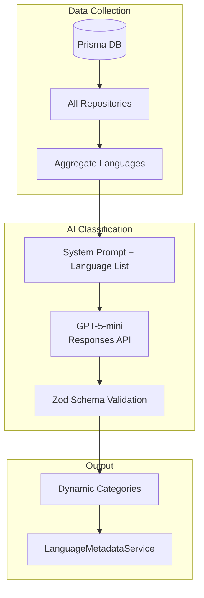
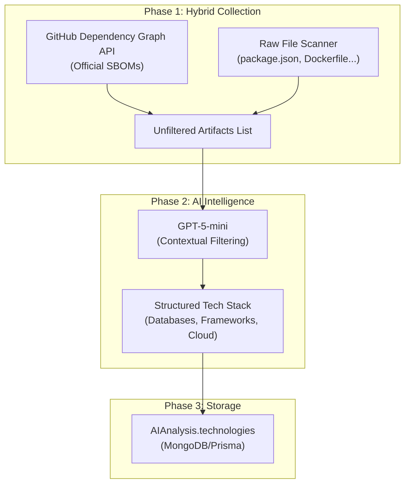

# AI-Driven Dynamic Language Classification - Implementation Plan

## Objective

**Eliminate all hardcoded values** for language categories by:
1. Collecting languages dynamically from all user repositories
2. Sending aggregated language list to GPT-5-mini via Responses API
3. Using Structured Outputs (Zod) for type-safe AI responses

---

## Architecture



---

## Proposed Changes

### 1. [NEW] [src/services/LanguageCategoryAIService.ts](file:///Users/usernamap/Documents/dev/gh-insight-engine/src/services/LanguageCategoryAIService.ts)

New service using OpenAI Responses API with Structured Outputs:

```typescript
import OpenAI from 'openai';
import { zodTextFormat } from 'openai/helpers/zod';
import { z } from 'zod';

// Zod schema for AI output
const LanguageCategorySchema = z.object({
    categories: z.array(z.object({
        name: z.string().describe('Category identifier (snake_case)'),
        displayName: z.string().describe('Human-readable name'),
        description: z.string().describe('What this category represents'),
        languages: z.array(z.string()).describe('Languages in this category'),
    })),
    languageToCategories: z.record(z.string(), z.array(z.string()))
        .describe('Mapping of each language to its categories'),
});

export class LanguageCategoryAIService {
    static async classifyLanguages(
        languages: { name: string; bytes: number }[]
    ) {
        const response = await openai.responses.parse({
            model: 'gpt-5-mini',
            input: [
                { role: 'system', content: SYSTEM_PROMPT },
                { role: 'user', content: JSON.stringify(languages) }
            ],
            text: { format: zodTextFormat(LanguageCategorySchema, 'categories') }
        });
        return response.output_parsed;
    }
}
```

---

### 2. [MODIFY] [src/services/LanguageMetadataService.ts](file:///Users/usernamap/Documents/dev/gh-insight-engine/src/services/LanguageMetadataService.ts)

Add method to collect languages and use AI classification:

```typescript
// New method
public async collectAndClassifyLanguages(userId: string): Promise<void> {
    // 1. Collect all unique languages from all repos
    const repos = await RepositoryModel.findByUserId(userId);
    const languageMap = new Map<string, number>();
    
    for (const repo of repos) {
        for (const lang of repo.languages.nodes) {
            languageMap.set(lang.name, 
                (languageMap.get(lang.name) ?? 0) + lang.size);
        }
    }
    
    // 2. Call AI service
    const aiCategories = await LanguageCategoryAIService.classifyLanguages(
        Array.from(languageMap.entries()).map(([name, bytes]) => ({ name, bytes }))
    );
    
    // 3. Update internal cache with AI-generated categories
    this.updateCategoriesFromAI(aiCategories);
}
```

---

### 3. [MODIFY] [src/types/languages.ts](file:///Users/usernamap/Documents/dev/gh-insight-engine/src/types/languages.ts)

Make [LanguageCategory](file:///Users/usernamap/Documents/dev/gh-insight-engine/src/types/languages.ts#17-18) dynamic:

```typescript
// Remove hardcoded enum, use type from AI
export type LanguageCategory = string; // Dynamic from AI

// Add interface for AI-generated categories
export interface AIGeneratedCategory {
    name: string;           // e.g., "frontend"
    displayName: string;    // e.g., "Frontend Development"
    description: string;
    languages: string[];
}
```

---

### 4. [MODIFY] [src/constants/languages.constants.ts](file:///Users/usernamap/Documents/dev/gh-insight-engine/src/constants/languages.constants.ts)

Remove hardcoded `LANGUAGE_CATEGORY_RULES`:

```diff
- export const LANGUAGE_CATEGORY_RULES: Record<LanguageCategory, CategoryRule> = {
-     [LanguageCategory.FRONTEND]: { ... },
-     // ... other categories
- };

+ // Categories are now dynamically generated by AI
+ // See LanguageCategoryAIService for implementation
```

---

## System Prompt for AI Classification

```text
You are an expert developer skill classifier.
Given a list of programming languages with their byte counts,
classify each language into appropriate skill categories.

Categories should reflect real developer expertise domains like:
- Frontend Development (web UI technologies)
- Backend Development (server-side languages)
- Mobile Development (iOS/Android)
- Data Science (statistical/ML)
- DevOps (infrastructure/CI-CD)
- Systems Programming (low-level)
- Game Development
- etc.

Rules:
1. A language can belong to multiple categories
2. Consider the context of usage (e.g., Python for data science vs backend)
3. Use snake_case for category identifiers
4. Provide meaningful descriptions
```

---

## Verification Plan

1. **Unit Test**: Mock OpenAI response, verify Zod parsing
2. **Integration Test**: Real API call with sample language list
3. **Build Check**: `npm run build && npm run lint`

---

## User Review Required

> [!IMPORTANT]
> - Responses API requires `openai` package >= 4.x (verify version)
> - GPT-5-mini supports Structured Outputs (confirmed)
> - AI classification adds latency (~1-2s per call)

> [!WARNING]
> **Breaking Change**: [LanguageCategory](file:///Users/usernamap/Documents/dev/gh-insight-engine/src/types/languages.ts#17-18) enum → dynamic string type

---

## Phase 6: Advanced Technology Discovery (Tech Stack Analysis)

**Objective**: Detailed extraction of libraries, frameworks, databases, and infrastructure from all user repositories using a "No Limit" Hybrid approach + AI Filtering.

### 1. Architecture: The "Deep Dive" Pipeline



### 2. Implementation Components

#### A. `TechnologyExtractionService.ts` (The Collector)
Responsible for harvesting raw data with **zero limit** strategy.

- **Method**: `collectRawartifacts(repos: Repository[])`
- **Strategy**:
    1.  **Dependency Graph**: Call `GET /repos/{owner}/{repo}/dependency-graph/sbom` for every repo.
    2.  **File Scanner**: 
        -   Recursive Tree Walk (using GraphQL `object(expression: "HEAD:") { ...tree... }`)
        -   Filter filenames: [package.json](file:///Users/usernamap/Documents/dev/gh-insight-engine/package.json), `go.mod`, `Dockerfile`, `docker-compose.yml`, `*.tf`, `.github/workflows/*.yml`
        -   **Concurrency**: Batch requests (pool size: 5) to respect API Rate Limits.
        -   **Reliability**: Exponential Backoff Retry (up to 5 attempts) for 429/5xx errors.

#### B. `TechnologyAnalysisService.ts` (The Refiner)
Responsible for AI processing.

-   **Input**: JSON List of `{ repo: string, file: string, content_snippet: string, dependencies: string[] }`
-   **Prompt Strategy**: "Curator Mode". 
    -   *Input*: "lodash, react, stripe, left-pad, webpack, postgresql-client"
    -   *Action*: Categorize & Filter Noise.
    -   *Output*: `{ "payment": ["Stripe"], "database": ["PostgreSQL"], "frontend": ["React"] }`

#### C. Database Schema Update ([prisma/schema.prisma](file:///Users/usernamap/Documents/dev/gh-insight-engine/prisma/schema.prisma))
Update [AIAnalysis](file:///Users/usernamap/Documents/dev/gh-insight-engine/src/services/AIAnalysisService.ts#715-742) model to store the structured result.

```prisma
model AIAnalysis {
  // ... existing fields
  
  // [NEW] Structured Tech Stack
  // Stores { categories: { ... }, raw_sources: { ... } }
  technologies Json? 
}
```

### 3. "No Limit" & Resilience Strategy
To ensure we capture 100% of the reality:

1.  **Pagination Recursion**: All valid paginated endpoints (repos, trees) must loop `hasNextPage` until exhausted.
2.  **Payload Chunking**: If the list of artifacts is too large for one LLM prompt (128k context), split into chunks -> Process -> Merge results.
3.  **Error Handling**: "Fail Partial, Succeed Global". If one repo fails to scan, log error but continue others.

### 4. Implementation Steps
1.  [ ] Update [prisma/schema.prisma](file:///Users/usernamap/Documents/dev/gh-insight-engine/prisma/schema.prisma) & Generate Client
2.  [ ] Create `TechnologyExtractionService` (Hybrid Collector)
3.  [ ] Update [LanguageCategoryAIService](file:///Users/usernamap/Documents/dev/gh-insight-engine/src/services/LanguageCategoryAIService.ts#111-328) -> Rename to `AIClassificationService` to handle both Languages & Tech.
4.  [ ] Implement `refineTechnologyStack` in AI Service.
5.  [ ] Wire everything into `UserRefreshController`.

